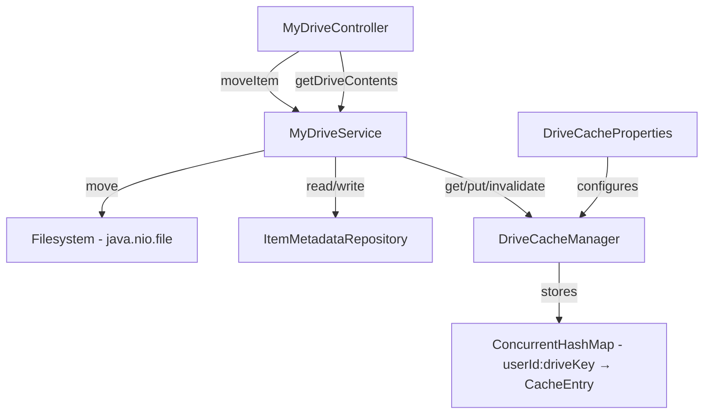

# Design Document: MyDrive Enhancements

## Overview

This design covers two enhancements to the Paradise backend MyDrive feature:

1. **Move files and folders** — A new `PUT /users/{userId}/drives/{driveKey}/items/{itemId}/move` endpoint that relocates files and folders on the filesystem, updates the `DriveItem` parentId, and enforces validation rules (missing items, name conflicts, circular nesting, root protection, mediaCache read-only).

2. **Server-side drive contents caching** — An in-memory cache layer in `MyDriveService` that stores pre-computed `Map<String, DriveItem>` responses keyed by `userId + driveKey`. The cache uses a configurable 2-hour TTL, is scoped-invalidated on write operations, falls back to direct filesystem traversal on error, and is toggled per drive key via application properties (mediaCache enabled by default).

Both features integrate into the existing `MyDriveController` → `MyDriveService` architecture, reusing the established permission model, exception hierarchy, and filesystem-backed storage pattern.

## Architecture

The existing architecture follows a standard Spring Boot layered pattern:

```
Controller (MyDriveController) → Service (MyDriveService) → Filesystem + JPA (ItemMetadataRepository)
```

The enhancements extend this without introducing new layers:



### Move Operation Flow

1. Controller receives `PUT .../items/{itemId}/move` with `MoveRequest` body
2. Service validates drive key, checks permissions (`checkPermission` with `isWrite=true`)
3. Service resolves source item path and destination parent path via `resolveItemPath`
4. Service validates: item exists, destination exists, not root, no circular nesting, no name conflict
5. Service performs `Files.move()` on the filesystem
6. Service returns updated `DriveItem` with new `parentId`
7. If caching is enabled for this drive, the cache entry is invalidated

### Cache Read Flow

1. `getDriveContents` checks if caching is enabled for the requested drive key
2. If enabled, looks up `CacheEntry` by composite key `userId:driveKey`
3. If entry exists and is not stale (within TTL), returns cached flat map
4. If stale or missing, performs filesystem traversal, stores result, returns it
5. On any cache error, falls back to direct traversal and logs the error

## Components and Interfaces

### New DTO: MoveRequest

```java
package com.dylanjohnpratt.paradise.be.dto;

import jakarta.validation.constraints.NotBlank;

public record MoveRequest(
    @NotBlank String parentId
) {}
```

### New Component: DriveCacheManager

Encapsulates cache storage, TTL checking, and invalidation logic. Injected into `MyDriveService`.

```java
package com.dylanjohnpratt.paradise.be.service;

public class DriveCacheManager {
    private final ConcurrentHashMap<String, CacheEntry> cache = new ConcurrentHashMap<>();
    private final DriveCacheProperties cacheProperties;

    public Optional<Map<String, DriveItem>> get(String userId, String driveKey);
    public void put(String userId, String driveKey, Map<String, DriveItem> contents);
    public void invalidate(String userId, String driveKey);
    public boolean isEnabled(String driveKey);

    String cacheKey(String userId, String driveKey);  // returns "userId:driveKey"
}
```

### New Configuration: DriveCacheProperties

```java
package com.dylanjohnpratt.paradise.be.config;

@ConfigurationProperties(prefix = "drive.cache")
public record DriveCacheProperties(
    Duration ttl,           // default: PT2H (2 hours)
    boolean myDrive,        // default: false
    boolean sharedDrive,    // default: false
    boolean adminDrive,     // default: false
    boolean mediaCache      // default: true
) {}
```

Application properties example:
```properties
drive.cache.ttl=PT2H
drive.cache.my-drive=false
drive.cache.shared-drive=false
drive.cache.admin-drive=false
drive.cache.media-cache=true
```

### Inner Class: CacheEntry

```java
record CacheEntry(
    Map<String, DriveItem> contents,
    Instant createdAt
) {
    boolean isStale(Duration ttl) {
        return Instant.now().isAfter(createdAt.plus(ttl));
    }
}
```

### Controller Addition

New endpoint in `MyDriveController`:

```java
@PutMapping("/items/{itemId}/move")
public ResponseEntity<DriveItem> moveItem(
        @PathVariable String userId,
        @PathVariable String driveKey,
        @PathVariable String itemId,
        @Valid @RequestBody MoveRequest request,
        @AuthenticationPrincipal User currentUser) {
    validateDriveKey(driveKey);
    DriveItem item = myDriveService.moveItem(userId, driveKey, itemId, request, currentUser);
    return ResponseEntity.ok(item);
}
```

### Service Addition: moveItem

New method in `MyDriveService`:

```java
public DriveItem moveItem(String userId, String driveKey, String itemId,
                          MoveRequest request, User currentUser) {
    // 1. Parse key, check permissions (isWrite=true)
    // 2. Reject if itemId is "root"
    // 3. Resolve source path and destination parent path
    // 4. Validate both exist
    // 5. Check circular nesting (destination is not a descendant of source)
    // 6. Check name conflict in destination
    // 7. Files.move(sourcePath, destinationParentPath.resolve(sourcePath.getFileName()))
    // 8. Invalidate cache if enabled
    // 9. Return updated DriveItem with new parentId
}
```

### Modified: getDriveContents

The existing method gains a cache-first path:

```java
public Map<String, DriveItem> getDriveContents(String userId, String driveKey, User currentUser) {
    // ... existing permission check ...

    // NEW: cache lookup
    if (driveCacheManager.isEnabled(driveKey)) {
        Optional<Map<String, DriveItem>> cached = driveCacheManager.get(userId, driveKey);
        if (cached.isPresent()) {
            return cached.get();
        }
    }

    // ... existing filesystem traversal ...

    // NEW: cache store
    if (driveCacheManager.isEnabled(driveKey)) {
        driveCacheManager.put(userId, driveKey, flatMap);
    }

    return flatMap;
}
```

### Modified: All Write Operations

Each write method (`createFolder`, `uploadFile`, `updateItem`, `deleteItem`, `moveItem`) gains a cache invalidation call at the end:

```java
driveCacheManager.invalidate(userId, driveKey);
```

## Data Models

### MoveRequest DTO

| Field    | Type   | Validation | Description                          |
|----------|--------|------------|--------------------------------------|
| parentId | String | @NotBlank  | ID of the destination parent folder  |

### CacheEntry (internal)

| Field     | Type                      | Description                        |
|-----------|---------------------------|------------------------------------|
| contents  | Map\<String, DriveItem\>  | The cached flat map response       |
| createdAt | Instant                   | Timestamp when the entry was stored|

### DriveCacheProperties

| Field       | Type     | Default | Description                          |
|-------------|----------|---------|--------------------------------------|
| ttl         | Duration | PT2H    | Time-to-live for cache entries       |
| myDrive     | boolean  | false   | Enable caching for myDrive           |
| sharedDrive | boolean  | false   | Enable caching for sharedDrive       |
| adminDrive  | boolean  | false   | Enable caching for adminDrive        |
| mediaCache  | boolean  | true    | Enable caching for mediaCache        |

### Existing Models (unchanged)

- **DriveItem** record: `id, name, type, fileType, size, color, children, parentId`
- **DriveKey** enum: `myDrive, sharedDrive, adminDrive, mediaCache`
- **ItemMetadata** entity: stores color metadata per item in the database

No database schema changes are required. The cache is purely in-memory. The move operation reuses existing filesystem paths and ID generation (`generateItemId`).

## Correctness Properties

*A property is a characteristic or behavior that should hold true across all valid executions of a system — essentially, a formal statement about what the system should do. Properties serve as the bridge between human-readable specifications and machine-verifiable correctness guarantees.*

### Property 1: Move correctness — filesystem relocation and parentId update

*For any* drive item (file or folder) and *for any* valid destination folder within the same drive, after a successful move operation, the item should exist on the filesystem inside the destination folder's directory AND the returned `DriveItem` should have its `parentId` set to the destination folder's ID.

**Validates: Requirements 1.2, 1.3**

### Property 2: Non-existent ID rejection

*For any* move request where either the item ID does not correspond to an existing item or the destination `parentId` does not correspond to an existing folder, the service should throw a `DriveItemNotFoundException`.

**Validates: Requirements 1.4, 1.5**

### Property 3: Name conflict rejection

*For any* destination folder that already contains a child with the same name as the item being moved, the move operation should throw a `DriveItemConflictException` and leave the filesystem unchanged.

**Validates: Requirements 1.6**

### Property 4: Circular nesting prevention

*For any* folder and *for any* of its descendants (direct or transitive), attempting to move the folder into that descendant should throw a `DriveItemConflictException` and leave the filesystem unchanged.

**Validates: Requirements 1.8**

### Property 5: Permission enforcement on move

*For any* user and drive key combination, the move operation should enforce the same permission rules as other write operations. Specifically, *for any* `DriveKey` where `checkPermission(key, userId, currentUser, true)` would throw, `moveItem` should also throw the same exception.

**Validates: Requirements 1.9, 1.10**

### Property 6: Cache TTL correctness

*For any* cache entry and *for any* TTL duration, if the entry's age is less than the TTL then `get()` should return the cached value, and if the entry's age exceeds the TTL then `get()` should return empty (triggering a fresh traversal).

**Validates: Requirements 2.2, 2.3, 2.4**

### Property 7: Scoped cache invalidation

*For any* set of cache entries across different `userId:driveKey` combinations, invalidating one specific entry should leave all other entries intact and retrievable.

**Validates: Requirements 2.1, 2.6**

### Property 8: Write operations invalidate cache

*For any* write operation (createFolder, uploadFile, updateItem, deleteItem, moveItem) performed on a cache-enabled drive, the cache entry for that `userId:driveKey` should be invalidated, so the next `getDriveContents` call performs a fresh filesystem traversal.

**Validates: Requirements 2.5**

## Error Handling

The move operation reuses the existing exception hierarchy and `MyDriveExceptionHandler`:

| Scenario                          | Exception                      | HTTP Status | Error Code             |
|-----------------------------------|--------------------------------|-------------|------------------------|
| Item ID not found                 | `DriveItemNotFoundException`   | 404         | DRIVE_ITEM_NOT_FOUND   |
| Destination parentId not found    | `DriveItemNotFoundException`   | 404         | DRIVE_ITEM_NOT_FOUND   |
| Name conflict in destination      | `DriveItemConflictException`   | 409         | DRIVE_ITEM_CONFLICT    |
| Circular nesting detected         | `DriveItemConflictException`   | 409         | DRIVE_ITEM_CONFLICT    |
| Attempting to move root           | `DriveRootDeletionException`   | 400         | DRIVE_ROOT_DELETION    |
| Permission denied / mediaCache    | `DriveAccessDeniedException`   | 403         | DRIVE_ACCESS_DENIED    |
| Filesystem I/O failure during move| `DriveUnavailableException`    | 503         | DRIVE_UNAVAILABLE      |
| Invalid drive key                 | `InvalidDriveKeyException`     | 400         | INVALID_DRIVE_KEY      |

For caching:
- Cache retrieval errors are caught internally, logged via SLF4J, and the service falls back to direct filesystem traversal. No exception is propagated to the caller.
- Cache put/invalidate errors are logged but do not affect the response.

No new exception classes are needed. All error scenarios map to existing exceptions handled by `MyDriveExceptionHandler`.

## Testing Strategy

### Property-Based Testing

The project already includes **jqwik 1.9.2** as a test dependency. All correctness properties will be implemented as jqwik property tests.

Configuration:
- Minimum 100 iterations per property test (`@Property(tries = 100)`)
- Each test tagged with a comment: `// Feature: mydrive-enhancements, Property N: <title>`
- Custom `@Provide` arbitraries for generating:
  - Random drive tree structures (folders with files/subfolders)
  - Random valid/invalid item IDs
  - Random `MoveRequest` payloads
  - Random `userId:driveKey` cache key combinations
  - Random TTL durations and entry ages

Property tests to implement (one test per property):

1. **Move correctness** — Generate a random drive tree on a temp filesystem, pick a random item and a random valid destination, call `moveItem`, verify filesystem state and returned `parentId`.
2. **Non-existent ID rejection** — Generate random non-existent IDs (UUIDs not in the tree), call `moveItem`, assert `DriveItemNotFoundException`.
3. **Name conflict rejection** — Generate a tree where the destination already has a child with the same name, call `moveItem`, assert `DriveItemConflictException` and filesystem unchanged.
4. **Circular nesting prevention** — Generate a random tree, pick a folder and one of its descendants as destination, call `moveItem`, assert `DriveItemConflictException`.
5. **Permission enforcement** — Generate random user/driveKey combos, verify `moveItem` throws the same exception as `checkPermission` would for write access.
6. **Cache TTL correctness** — Generate random TTL durations and entry ages, verify `CacheEntry.isStale()` returns the correct boolean, and verify `DriveCacheManager.get()` returns present/empty accordingly.
7. **Scoped cache invalidation** — Generate a random set of cache entries, invalidate one, verify all others remain.
8. **Write operations invalidate cache** — Populate cache, perform a random write operation, verify the cache entry is gone.

### Unit Testing

Unit tests complement property tests for specific examples and edge cases:

- Move root item → `DriveRootDeletionException`
- Move on mediaCache → `DriveAccessDeniedException`
- Cache error fallback → mock cache to throw, verify filesystem traversal still works
- Default cache properties → verify mediaCache enabled, others disabled
- `CacheEntry.isStale()` with exact boundary values (TTL - 1ms, TTL, TTL + 1ms)
- Move item to its current parent (no-op move) → should succeed without error
- Controller endpoint integration test → verify PUT routing and response status

### Test Organization

```
be/src/test/java/com/dylanjohnpratt/paradise/be/
├── service/
│   ├── MyDriveServiceMoveTest.java          # Unit tests for moveItem
│   ├── MyDriveServiceMovePropertyTest.java  # jqwik property tests for move (Properties 1-5)
│   ├── DriveCacheManagerTest.java           # Unit tests for cache
│   └── DriveCacheManagerPropertyTest.java   # jqwik property tests for cache (Properties 6-8)
└── controller/
    └── MyDriveControllerMoveTest.java       # Integration test for move endpoint
```
